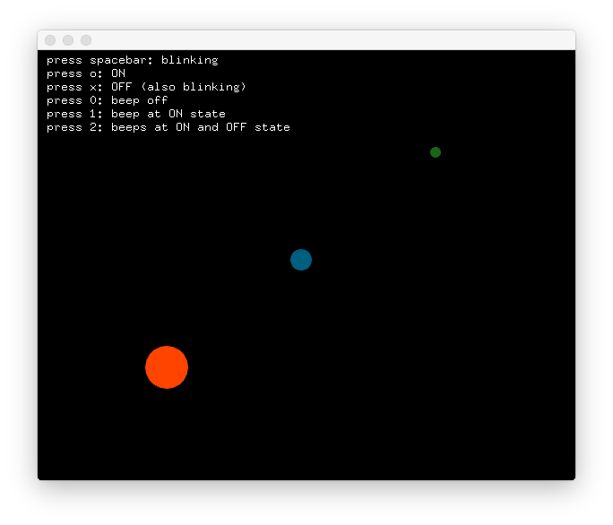
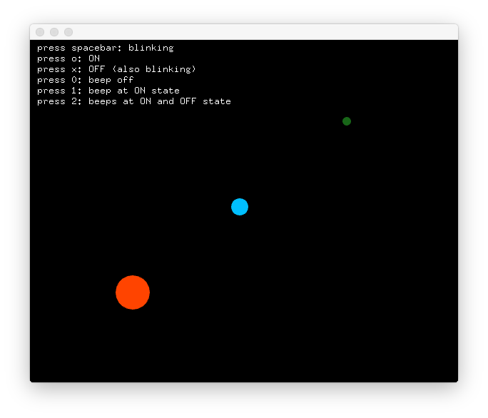

# test_ofx_blinky
A small openframeworks program to test my ofx_blinky class

## dependencies
* [openframeworks](https://openframeworks.cc) version 0.9.x or higher
* [ofx_blinky](https://github.com/felixdollack/ofx_blinky.git) (is already included as submodule)

## compile
Use the project generator, bundled with openframeworks,
to update the project folder and generate build files
for your system (make, mcvs, xcode, etc).

## Example
After successful compilation, copy the two wav files in src/ofx_blinky
to bin/data before running the executable to avoid errors.
There will be three dots. A blue one in the center of the screen,
a green one in the upper right corner and an orange one in the lower left.
The green and orange dot will blink at different speeds and beep with
a high and low sound respectively.

By pressing one of the keys, as instructed on the screen,
you can control the blue dot.

